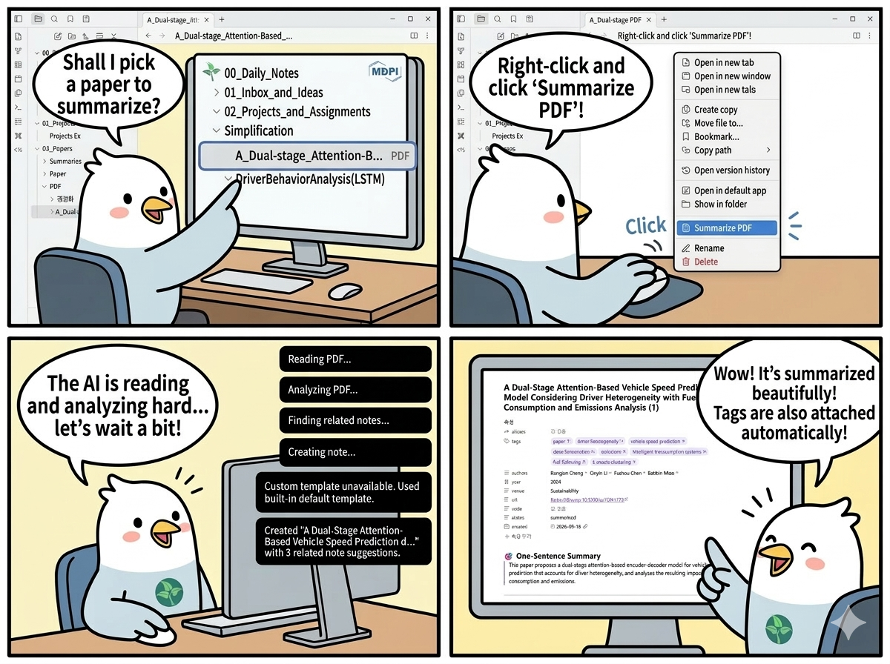

# Paper Summary

Paper Summary turns a PDF already stored in your Obsidian vault into a structured paper note with frontmatter, summary sections, and local related-paper links.

Inspired by Obsidian Extract PDF, Obsidian LLM Summary, Obsidian AI Tagger, Smart Connections, and Paper Clipper.



## Features

- Summarize a vault PDF into a ready-to-read Markdown note from the command palette or the PDF file menu.
- Generate a consistent built-in paper note with frontmatter, summary sections, and related-note links.
- Use the built-in template or a custom vault Markdown template with placeholder-based rendering.
- Choose output language for generated summary prose: English, Korean, Auto, or Custom.
- Add local paper-to-paper links using tags, title similarity, author overlap, venue and year signals, and section-keyword overlap.
- Keep filenames safe for Obsidian and automatically create `name (1).md`, `name (2).md`, and so on when a target name already exists.

## Supported Providers

- `openai`: standard OpenAI-style hosted API path.
- `openrouter`: OpenAI-compatible path plus OpenRouter-specific routing options.
- `gemini`: Google's OpenAI-compatible Gemini endpoint.
- `claude`: Anthropic's OpenAI compatibility layer. Structured output is best-effort here.
- `ollama`: local OpenAI-compatible Ollama endpoint. Behavior depends on the installed model and runtime.
- `others`: generic OpenAI-compatible endpoint for custom providers and gateways.

Paper Summary currently uses one OpenAI-compatible request pipeline for all providers, with OpenRouter as the only provider that adds explicit request extras.

## Installation

Paper Summary currently documents manual release installation as the primary path.

1. Download `manifest.json`, `main.js`, and `styles.css` from the latest release.
2. Create this folder inside your vault:

```text
<your-vault>/.obsidian/plugins/paper-summary/
```

3. Copy the three release files into that folder.
4. In Obsidian, open `Settings -> Community plugins`.
5. Enable Paper Summary.

## How to Use

1. Put the PDF you want to summarize inside your vault.
2. Open `Settings -> Paper Summary` and configure at least your provider, API key if your provider needs one, and model.
3. Optionally set the output language, output template, output folder, and paper notes scope for related linking.
4. Open the PDF and run either `Summarize active PDF` from the command palette or `Summarize PDF` from the PDF file menu.
5. The plugin extracts text, analyzes the paper, finds related paper notes, and creates a Markdown note in your output folder.
6. If `Open generated note` is enabled, the new note opens automatically.

For built-in notes, you can later run `Refresh related paper links` on the active summary note to recompute the `Related Notes` section from your current vault papers.

## Settings Overview

- `Provider`, `API key`, `Base URL`, and `Model` control the remote API endpoint and model selection.
- `Structured output mode` chooses between `JSON object` and `JSON schema`. `JSON object` is the safer compatibility default.
- `Output language` controls generated summary prose. `Auto` means the paper's dominant language, not the Obsidian UI language.
- `Output template` lets you keep the built-in format or point to a custom vault Markdown template.
- `Output folder` sets where new paper notes are created.
- `Paper notes scope` controls which folder is scanned for existing paper summaries when related links are generated or refreshed.
- `Maximum PDF pages` and `Maximum characters` limit extraction size before analysis.
- `Paper tag`, `Default status`, and `Related notes limit` shape the generated note metadata and linking behavior.
- OpenRouter adds extra settings for routing, attribution headers, and fallback behavior only when `openrouter` is selected.

## Generated Note Structure

The built-in note format keeps a stable paper-summary structure.

Frontmatter includes:

- `aliases`
- `tags`
- `authors`
- `source_pdf`
- `source_pdf_link`
- `reading_status`
- `year`
- `venue`
- `url`
- `code`
- `status`
- `created`

The built-in body includes these sections:

- One-Sentence Summary
- Key Contributions
- Methodology & Architecture
- Results & Performance
- Limitations & Future Work
- My Thoughts & Ideas
- Related Notes

`reading_status` defaults to `unread`. `status` stays separate and uses your configured default status. The source PDF path and wiki link are written into frontmatter only.

## Limitations and Troubleshooting

- The plugin works on PDFs that are already inside your vault.
- `claude`, `ollama`, and `others` are best-effort through the current OpenAI-compatible request path. Some structured-output behaviors can vary by provider or model.
- `Custom template` mode falls back to the built-in template if the template path is missing, unreadable, empty, or invalid.
- `Refresh related paper links` only rewrites the built-in paper-note format. It does not rewrite custom-template notes.
- Related-note suggestions are local heuristic matches, not embeddings. Common tags or weak metadata can still produce imperfect links.
- If generation fails, first check the provider, API key, base URL, model, and whether the selected model supports your chosen structured output mode well enough.

## More Details

- [Advanced reference](docs/advanced-reference.md)
- [Built-in note contract](Paper%20Ex.md)
- [MIT License](LICENSE)
